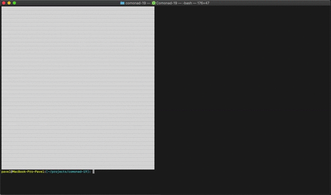

# 🦠 Comonad-19
[](https://github.com/fp-ctd-itmo/hw2-pavponn/blob/master/LICENSE)

Playable simulation of a disease outbreak. It's a simplified model of a disease process based on [Outbreak](https://www.meltingasphalt.com/interactive/outbreak/) by Kevin Simpler. Despite the project's name, this is **not** an attempt to imitate the spread of COVID-19.

The goals were to learn how to use comonads in Haskell and to build something relevant in the light of recent months (spring 2020).

## Quickstart
You'll need [Stack](https://docs.haskellstack.org/), [GHC](https://www.haskell.org/ghc/) and [Git](https://git-scm.com/downloads).

💾 Clone/fork repo:
```bash
git clone https://github.com/pavponn/comonad-19.git
```
⚙️ Build/compile sources:
```bash
stack build
```
🚀 Run comonad-19:
```bash
stack run
```

## Model 
* Grid represents a population, grid is potentionally infinite 
* Each square of the grid represents a single person
  -  ⬜ — Susceptible
  -  🟧 — Infected (incubation period, no symptoms) 
  -  🟥 — Infected (with symptoms)
  -  🟩 — Recovered
* Parameters
  - Transmission Rate  — probability of infection's transmission between two people
  - Days in incubation — number of the days cell is in infected (incubation) state
  - Days with symptoms — number of the days cell is in infected (with symptoms) state
  - Days with immunity — number of the days cell is in recovered state before becoming susceptible

---
 

---

## Tests
Tested manually on macOS Catalina 10.15.4.

## Copyright
Pavel Ponomarev, 2020

MIT License.

